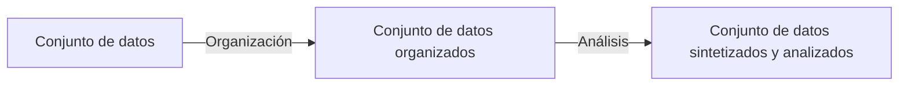

# Data VS Info Vs Intel

- **Data (Datos)**: Hechos aislados, sin mucho valor por separado ni coherencia. Por ejemplo, tres datos podrían ser: una ubicación, una hora y una MAC
- **Info**: Después de pasar una serie de datos por un proceso de organización, se les da una cierta estructura y se relacionan entre sí para darles coherencia (y valor). Por ejemplo, los tres datos anteriores organizados nos dan la información de cuándo exactamente estuvo una persona X en un lugar, otros ejemplos podrían ser un historial de compras y un historial de problemas psicológicos
- **Intel (inteligencia)**: La información obtenida de organizar datos sueltos puede o no ser reveladora o útil (contra más datos más completa será la info), en cualquier caso, someter esta información a un proceso de análisis y síntesis la convierte en inteligencia, es decir, información procesada con el objetivo saber más sobre algo o alguien, ya sea para predecir o investigar algo. Por ejemplo, con toda la información anterior se puede dar con el actor de un tiroteo, gracias a la información de su posición a la hora del crimen, junto a sus recientes compras de munición y su historial de esquizofrenia.

# Los principios de la ciberseguridad
## Seguridad (CIA)
- **Confidencialidad**
- **Integridad**
	- Captura, almacenamiento, recuperación, actualización, transferencia, congelado...
	- Hashing, AC...
- **Disponibilidad**
	- Mantenimiento de equipos, parcheo y actualizaciones, testeo de backups, planes contra desastres, monitoreo, testeo de disponibilidad
## Estados de la información
- **En tránsito**
- **En reposo**
- **En procesamiento**
## Los pilares de los sistemas
- **Personas**
- **Tecnología**
- **Prácticas y políticas**

![[mccumber.jpg|612x343]]

# Activos y amenazas
Un activo es cualquier objetivo, recurso, información o propiedad valiosa para una organización o individuo. Como tal, estos activos han de ser protegidos, los activos pueden ir desde objetos físicos hasta documentos, en el contexto de la ciberseguridad, puede tratarse de DBs, credenciales, información, recursos de cómputo o red...

Una amenaza es cualquier evento, desastre, fallo, individuo o grupo que puede potencialmente comprometer la CIA de un activo. Esto puede ir desde APTs hasta terremotos. 
Un actor de amenazas es un agente que realiza estos eventos. 

Una vulnerabilidad, es una debilidad en un sistema que puede ser explota por un TA.

![[activos.png|739x415]]

# Políticas, estándares, guías y procedimientos
Toda organización que quiera estar protegida por una seguridad robusta debe contar con una serie de políticas, estándares, guías y procedimientos
## Políticas
Son las guías que desarrolla una organización para "gobernar" sus acciones, definen una serie de estándares de buen comportamiento para el negocio y sus empleados, fijando unas barreras de uso aceptable.
- **Políticas de la compañía**
- **Políticas de empleados**
- **Políticas de seguridad**
	Demuestra el compromiso con la seguridad; Fija reglas de comportamiento esperado; Asegura consistencia y coherencia en las operaciones, adquisición de software y hardware y mantenimiento; Define las consecuencias legales de las violaciones
	- Política de identificación y autenticación
	- Política de contraseñas
	- Política de uso aceptable (AUP)
	- Política de acceso remoto
	- Política de mantenimiento de red
	- Política de gestión de incidentes
	- Política de BYOD (Bring Your Own Device)
- ## Estándares
- ## Guías
- ## Procedimientos

# Los fundamentos de una organización segura
- Desarrollo de una política de seguridad escrita por para la organización
- Formación y de los empleados en materia de buenas prácticas, concienciación de ingeniería social y métodos de verificación de identidad
- Controles físicos a los dominios
- Rotación de contraseñas y credenciales robustas, multifactor o passwordless.
- Aplicación correcta y segura del cifrado.
- Hardware pertinente: Firewalls, VPNs, IPSs, antivirus, antiphishing...
- Hacer copias de seguridad a menudo y almacenarlas de manera segura
- Mantenimiento y patching rutinario de los sistemas
- Apagado / eliminación de los endpoints, servicios y puertos inutilizados
- Auditorías frecuentes
![[hostVSperimetral.png|639x358]]