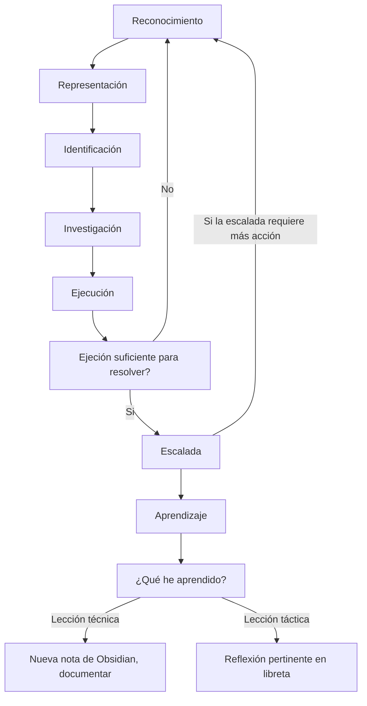

```mermaid
flowchart TB

r1[Reconocimiento]
r2[Representación]
i1[Identificación]
i2[Investigación]
e1[Ejecución]
e1Q[Ejeción suficiente para resolver?]
e2[Escalada]
a[Aprendizaje]
aQ[¿Qué he aprendido?]
f1[Nueva nota de Obsidian, documentar]
f2[Reflexión pertinente en libreta]

r1 --> r2
r2 --> i1
i1 --> i2
i2 --> e1
e1 --> e1Q
e1Q -- Si --> e2
e1Q -- No --> r1
e2 --> a
e2 -- Si la escalada requiere más acción --> r1
a --> aQ
aQ -- Lección técnica --> f1
aQ -- Lección táctica --> f2
```
